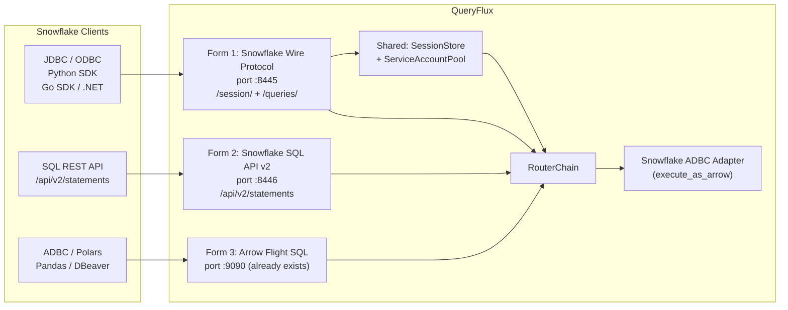
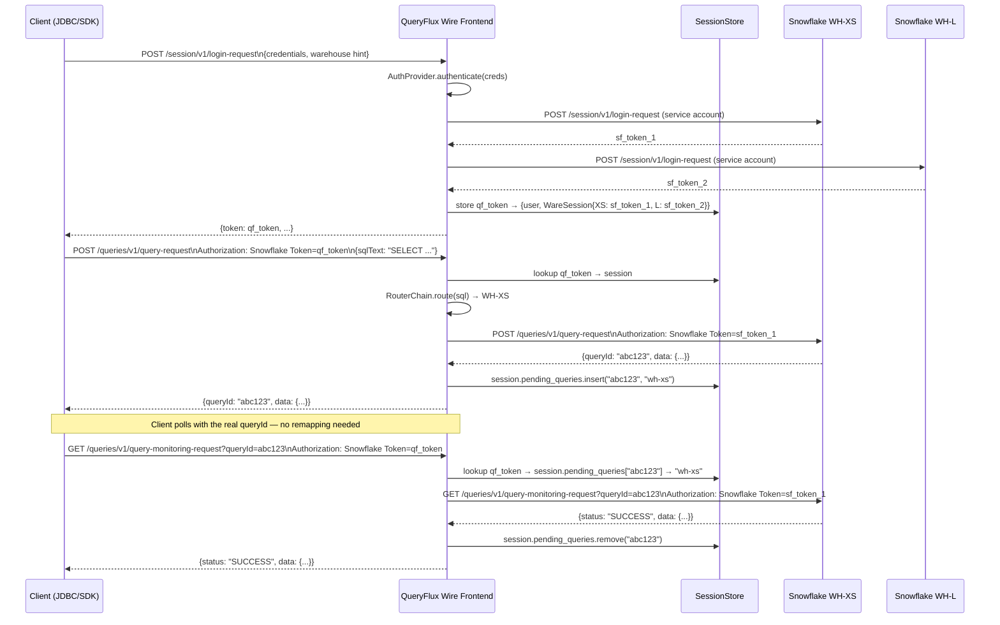

# Snowflake Frontend — All Forms

## The Three Client Entry Points




---

## Form 1 — Snowflake Wire Protocol (Most Important)

Covers every official Snowflake connector: JDBC, ODBC, Python, Go, Node.js, .NET, Spark connector, dbt. All use the internal HTTP API at `{account}.snowflakecomputing.com`.

### Protocol Routes (Axum, port 8445)


| Route                                  | Method | Purpose                          |
| -------------------------------------- | ------ | -------------------------------- |
| `/session/v1/login-request`            | POST   | Client login — start session     |
| `/session`                             | DELETE | Close session                    |
| `/session/token-request`               | POST   | Refresh access token             |
| `/session`                             | GET    | Heartbeat / validate session     |
| `/queries/v1/query-request`            | POST   | Execute SQL                      |
| `/queries/v1/query-monitoring-request` | GET    | Poll async query (queryId param) |
| `/queries/v1/{queryId}`                | DELETE | Cancel query                     |


Out of scope for MVP: `PUT`/`GET` for staged file transfers.

### Session Lifecycle (the Hard Part)

Snowflake sessions are stateful: the client carries an opaque token for its session lifetime (~60 min). QueryFlux must intercept this and substitute service-account tokens when forwarding to real Snowflake warehouses.




### Session Store Design

New component, lives in `queryflux-frontend/src/snowflake/http/session_store.rs`:

```rust
pub struct SnowflakeSessionStore {
    sessions: DashMap<String, SnowflakeSession>,  // qf_token → session
}

struct SnowflakeSession {
    qf_token: String,
    user: String,
    auth_ctx: AuthContext,
    // One service-account session per warehouse in the cluster group
    warehouse_sessions: HashMap<ClusterName, WareSession>,
    // Tracks in-flight async queries: real queryId → which cluster is running it
    // Enables monitoring/cancel routing without rewriting the queryId the client sees
    pending_queries: HashMap<String, ClusterName>,
    created_at: Instant,
}

struct WareSession {
    sf_token: String,         // real Snowflake auth token
    expires_at: Instant,      // 60-min TTL — must refresh proactively
}
```

Token expiry handling (critical — the Yuki article documents this as the main production pitfall): before forwarding any query, check `expires_at`. If within 5 min of expiry, refresh via `/session/token-request` on that warehouse. Token refresh must be serialized per warehouse (avoid concurrent refreshes).

### Query ID Routing — No Remapping Needed

The monitoring route (`GET /queries/v1/query-monitoring-request?queryId=abc123`) and cancel route (`DELETE /queries/v1/{queryId}`) must be forwarded to whichever warehouse ran the original query. Since the session is stateful and already in memory, the cluster is tracked inside the session itself via `pending_queries` — no encoding of the queryId is needed.

On query submission: `session.pending_queries.insert(real_queryId, cluster_name)`
On monitoring/cancel: `session.pending_queries.get(real_queryId)` → route to that cluster
On result delivery (final poll): `session.pending_queries.remove(real_queryId)` to avoid leaking memory

The client receives and uses the **real Snowflake queryId** unchanged — fully visible in Snowflake query history, support tools, and observability dashboards.

### Files

`proxy.rs` and `query_id.rs` are shared between Form 1 and Form 2, so they live in a parent `snowflake/` module rather than inside `snowflake_http/`:

```
crates/queryflux-frontend/src/snowflake/
├── mod.rs               # re-exports; declares http and sql_api submodules
├── proxy.rs             # shared: HTTP client for forwarding requests with token swap
├── http/                # Form 1 — Snowflake Wire Protocol
│   ├── mod.rs           # SnowflakeHttpFrontend, Axum router, FrontendListenerTrait
│   ├── session_store.rs # SnowflakeSessionStore, SnowflakeSession (+ pending_queries), WareSession
│   └── handlers/
│       ├── session.rs   # login, logout, heartbeat
│       ├── query.rs     # query-request, monitoring (routes via pending_queries), cancel
│       └── token.rs     # token-request (refresh)
└── sql_api/             # Form 2 — Snowflake SQL REST API v2
    ├── mod.rs           # SnowflakeSqlApiFrontend, Axum router, FrontendListenerTrait
    ├── handlers.rs      # POST /api/v2/statements, GET, DELETE
    ├── auth.rs          # JWT generation from ClusterAuth::KeyPair (PKCS#8 → RS256)
    └── handle.rs        # encode/decode "{cluster}.{real_handle}" for stateless routing
```

- New `FrontendProtocol::SnowflakeHttp` variant in `[queryflux-core/src/query.rs](crates/queryflux-core/src/query.rs)`
- New `snowflake_http: Option<FrontendConfig>` in `FrontendsConfig` in `[queryflux-core/src/config.rs](crates/queryflux-core/src/config.rs)`
- `snowflake_sessions: Arc<SnowflakeSessionStore>` added to `AppState` in `[queryflux-frontend/src/state.rs](crates/queryflux-frontend/src/state.rs)`
- New `snowflake_http_future` arm added to `tokio::select!` in `[queryflux/src/main.rs](crates/queryflux/src/main.rs)`

### Routing at Query Time

The `POST /queries/v1/query-request` body contains:

```json
{
  "sqlText": "SELECT * FROM orders",
  "parameters": {...},
  "rowResultFormat": "json"
}
```

QueryFlux extracts `sqlText`, builds `SessionContext` from the session's stored `AuthContext`, then calls `RouterChain::route(sql, session, FrontendProtocol::SnowflakeHttp, auth_ctx)`. The selected cluster's `WareSession.sf_token` replaces the client's token before forwarding.

The raw Snowflake response is proxied back **unchanged** — real `queryId` included. No Arrow conversion needed — the actual execution happens on Snowflake, QueryFlux is a smart routing proxy on this path.

---

## Form 2 — Snowflake SQL API v2 (Public REST)

The officially documented public REST API. Used by custom integrations, Airflow operators, Terraform providers, and any tool calling Snowflake programmatically.

### Protocol Routes (Axum, port 8446)


| Route                                     | Method | Purpose                   |
| ----------------------------------------- | ------ | ------------------------- |
| `/api/v2/statements`                      | POST   | Submit SQL statement      |
| `/api/v2/statements/{handle}`             | GET    | Poll result / fetch pages |
| `/api/v2/statements/{handle}`             | DELETE | Cancel                    |
| `/api/v2/statements/{handle}?partition=N` | GET    | Fetch result page N       |


Auth: stateless — each request carries `Authorization: Bearer {JWT}` or `Snowflake Token="{token}"`. No session needed.

### Execution Model

This API is asynchronous: `POST /api/v2/statements` returns a `statementHandle`. QueryFlux can use this as an async backend (same submit+poll model as Trino). On `POST`:

1. Parse `statement` (SQL text) from JSON body
2. Route via `RouterChain` → select target cluster
3. Forward to target warehouse using service-account JWT (generated from `ClusterAuth::KeyPair`)
4. Persist `(real_statementHandle → ClusterName)` via `AppState.persistence`
5. Return real `statementHandle` to client unchanged
6. On `GET /{handle}`: look up cluster from persistence → forward with real handle

The `Persistence` trait is already in `AppState` and wired into every frontend — no new infrastructure needed. The client receives and uses the real Snowflake `statementHandle` with no modifications.

### Shared Infrastructure

Form 2 shares only the `proxy.rs` HTTP client from Form 1. No session store, no handle encoding. Auth is per-request via JWT generated from `ClusterAuth::KeyPair`.

### Files

Files live under the shared `snowflake/sql_api/` subtree (see Form 1 module structure above):

```
crates/queryflux-frontend/src/snowflake/sql_api/
├── mod.rs          # SnowflakeSqlApiFrontend, Axum router, FrontendListenerTrait
├── handlers.rs     # POST /api/v2/statements, GET, DELETE — uses ../proxy.rs + AppState.persistence
└── auth.rs         # JWT generation from ClusterAuth::KeyPair (PKCS#8 → RS256)
```

- New `FrontendProtocol::SnowflakeSqlApi` variant
- New `snowflake_sql_api: Option<FrontendConfig>` in `FrontendsConfig`
- New `snowflake_sql_api_future` arm in `main.rs`

---

## Form 3 — Arrow Flight SQL (Already Implemented, Routing Fix Required)

The existing `FlightSqlFrontend` at port 9090 already handles ADBC clients (Pandas, Polars, DBeaver with Flight SQL driver). No changes to the frontend itself.

**What needs to change (4 files, ~10 lines total):**

1. `[crates/queryflux-routing/src/implementations/protocol_based.rs](crates/queryflux-routing/src/implementations/protocol_based.rs)` — add `flight_sql: Option<ClusterGroupName>` to `ProtocolBasedRouter` struct; change `FrontendProtocol::FlightSql => None` to `self.flight_sql.clone()`
2. `[crates/queryflux-core/src/config.rs](crates/queryflux-core/src/config.rs)` — add `flight_sql: Option<String>` to `RouterConfig::ProtocolBased` enum variant
3. `[crates/queryflux/src/main.rs](crates/queryflux/src/main.rs)` — update **both** `ProtocolBasedRouter` struct constructions (~line 390 and ~line 1171) to destructure and pass `flight_sql`
4. `[crates/queryflux-routing/tests/router_tests.rs](crates/queryflux-routing/tests/router_tests.rs)` — add `flight_sql: None` to all 6 existing `ProtocolBasedRouter` struct literals; rename/update `protocol_router_flight_sql_not_routed` to test the new routing behaviour

Config change: set `flightSql: snowflake-analytics` in the `protocolBased` router section.

Flight SQL is then fully functional for routing to Snowflake clusters using `execute_as_arrow` from the Snowflake ADBC adapter.

**No handle remapping needed for Form 3.** Arrow Flight SQL is a gRPC streaming protocol — `DoGet` returns a stream of Arrow record batches directly. There is no async handle/poll model, so the cluster-routing problem that affects Forms 1 and 2 does not exist here.

---

## Config for All Three Forms

```yaml
frontends:
  snowflakeHttp:
    port: 8445
  snowflakeSqlApi:
    port: 8446
  flightSql:
    port: 9090      # already exists

routers:
  - type: protocolBased
    snowflakeHttp: snowflake-analytics
    snowflakeSqlApi: snowflake-analytics
    flightSql: snowflake-analytics
  # per-query routing on top of protocol:
  - type: queryRegex
    pattern: "^SELECT.*reporting.*"
    group: snowflake-large
  - type: header
    header: "x-warehouse-size"
    value: "large"
    group: snowflake-large
```

---

## Phasing

**Phase 1 — Form 3 (Arrow Flight SQL, ~10 lines across 4 files):**
Wire `FlightSql` routing in `protocol_based.rs`, `config.rs`, both construction sites in `main.rs`, and router tests. Enables ADBC/Polars/Pandas → QueryFlux → Snowflake immediately using the ADBC backend adapter.

**Phase 2 — Form 2 (SQL REST API v2):**
Stateless, no session complexity. JWT generation + HTTP proxy + handle remapping. Roughly 400 lines. Enables Airflow, Terraform, custom apps.

**Phase 3 — Form 1 (Snowflake Wire Protocol):**
Full session management, token pool, token refresh, session-scoped query tracking (no queryId rewriting). The main event for JDBC/ODBC/SDK users. Most complex (~1400 lines across 6 files).

---

## Key Risk: Snowflake Wire Protocol is Undocumented

The internal `POST /session/v1/login-request` and `POST /queries/v1/query-request` protocol is not officially documented. The contract must be derived from:

- [Snowflake Python connector source](https://github.com/snowflakedb/snowflake-connector-python)
- [Snowflake Go driver source](https://github.com/snowflakedb/gosnowflake)
- [Snowflake JDBC source](https://github.com/snowflakedb/snowflake-jdbc)

The public SQL REST API v2 (`/api/v2/statements`) is fully documented at [docs.snowflake.com/en/developer-guide/sql-api/reference](https://docs.snowflake.com/en/developer-guide/sql-api/reference.html) and is the stable, low-risk surface.

## Dependencies to Add

- `queryflux-frontend/Cargo.toml`:
  - `dashmap = { workspace = true }` — **already in workspace** (`Cargo.toml:58`), just add the workspace reference
  - `jsonwebtoken` + `rsa` — new, for Form 2 service-account JWT auth (PKCS#8 → RS256)
  - `base64` — **not needed**: Form 1 uses session-scoped tracking, Form 2 uses persistence lookup — no handle encoding in either form
- `queryflux-core/src/query.rs`: two new `FrontendProtocol` variants + two new `default_dialect()` match arms (both return `SqlDialect::Generic`)
- `queryflux-core/src/config.rs`: two new `Option<FrontendConfig>` fields in `FrontendsConfig`

