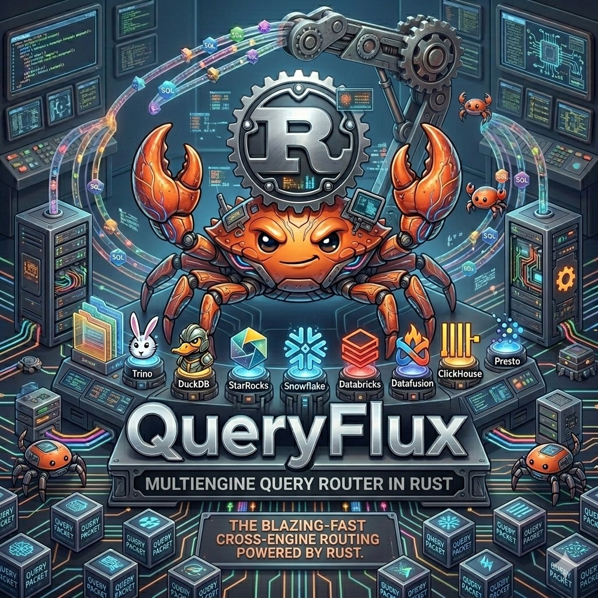

# QueryFlux architecture documentation

  

This folder describes how QueryFlux is put together: why it exists, how SQL is translated, and how traffic is routed to **cluster groups** and individual **clusters**.

| Document | What it covers |
|----------|----------------|
| [motivation-and-goals.md](motivation-and-goals.md) | Problem statement, goals, and relationship to prior art (e.g. trino-lb). |
| [architecture.md](architecture.md) | End-to-end query lifecycle, major crates, and component status (high level). |
| [query-translation.md](query-translation.md) | Dialect detection, sqlglot integration, when translation runs, and schema-aware mode. |
| [routing-and-clusters.md](routing-and-clusters.md) | Router chain, `routingFallback`, cluster groups, load-balancing strategies, and queueing. |
| [observability.md](observability.md) | Prometheus metrics, Grafana dashboard, QueryFlux Studio, and the Admin REST API. |
| [adding-engine-support.md](adding-engine-support.md) | Checklist for new **backend engines** (Rust adapters), **Studio** (`lib/studio-engines/` manifest + catalog slots), and **frontend wire protocols** (e.g. Postgres wire). |

Start with [motivation-and-goals.md](motivation-and-goals.md) if you are new to the project; use [architecture.md](architecture.md) as the single-page map of the system.
